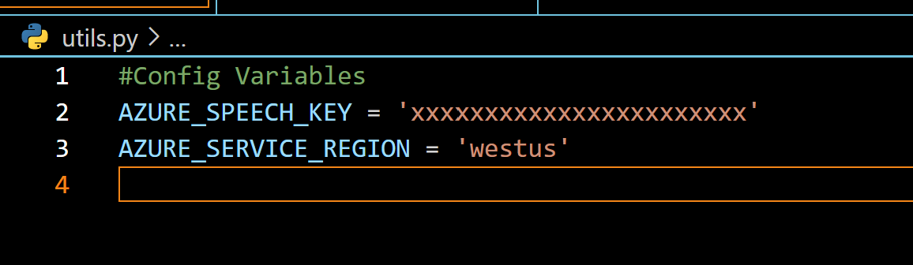

# Speech-To-Text using Azure Cognitive Service

The Speech-To-Text feature of the Azure Cognitive is a service that allows you to transcribe spoken words from a microphone or an audio recording.

The goal of this tutorial is to show you how to use Azure cognitive to transcribe a single file or a batch of files.

Fun Fact, I am using this very feature of Azure cognitive services embedded into Microsoft Word to dictate part of this tutorial.

The sample codes from this example is an adaptation of the samples from the following repos [https://github.com/Azure-Samples/cognitive-services-speech-sdk]

# Prerequisites

1 - Azure Subscription ("Azure account")
2 - Deploy a Speech-to-text resource from Azure Portal
3 - Get the **resource key** and **region**. After your Speech resource is deployed, select Go to resource to view and manage keys.
    For more information about Cognitive Services resources, see [Get the keys for your resource](https://docs.microsoft.com/en-us/azure/cognitive-services/cognitive-services-apis-create-account?tabs=multiservice%2Cwindows#get-the-keys-for-your-resource).

# How to run this example?

Use the steps below to successfully transcribe a .wav file and an MP3 recording.  
I will be transcribing the English language from the audio recordings and the Azure Cognitive  Service supports more than more than 100 languages and variants.

## Step 1 : Create the "utils.py" file

- Create the "utils.py" file and add the AZURE_SPEECH_KEY (resource key), AZURE_SERVICE_REGION (e.g. "eastus" or "westus" ) values from retrieved from the Azure portal.
- Keep the file at the folder root level as described below.

```sh
/.
/_utils.py
```



## Step 2: Create your virtual environment

 For my virtual environment, I use pipenv. Visit the following link to set up the pipenv environment : [https://pypi.org/project/pipenv/]
 In Python a virtual environment provide an isolation that helps test your application without making configuration changes to your working station(local machines or remote servers)  

# Step 3 : Running Batch transcript  (.wav)

Use the script below to transcribe the ".wav" files listed in the file named "testcase.py".

```sh
python callback_batch_transcript.py
```

# Step 4 : Transcribe mp3 to file

To transcript MP3 files on Windows, you will need to install few more packages.
Visit click here to learn **[How to use compressed input audio](https://docs.microsoft.com/en-us/azure/cognitive-services/speech-service/how-to-use-codec-compressed-audio-input-streams?tabs=windows%2Cdebian%2Cjava-android%2Cterminal&pivots=programming-language-python)**

```sh
    python transcribe-mp3-to-file.py 
```
# What next ?

* Transcribe a conversion 
* Deploy the solution on Azure using GitHub Actions  
